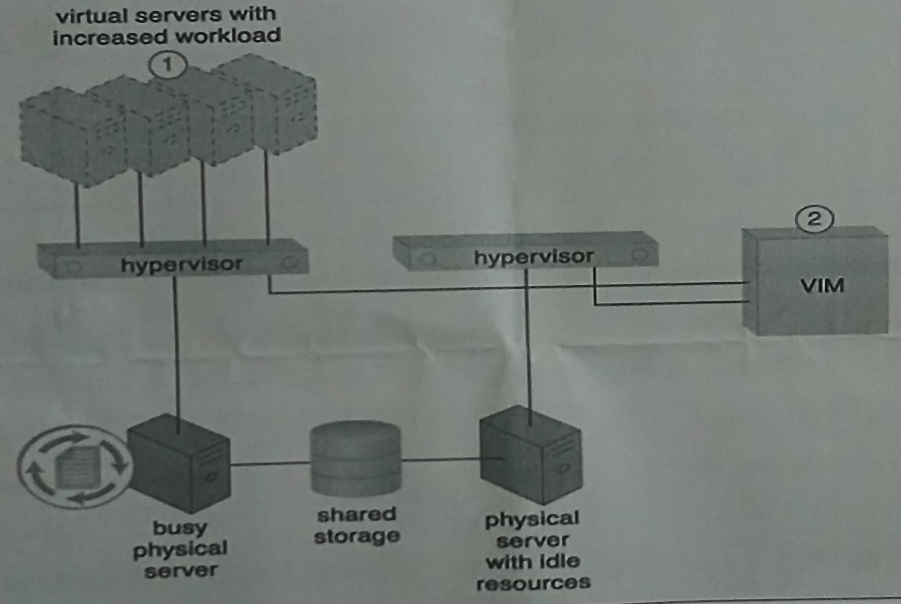
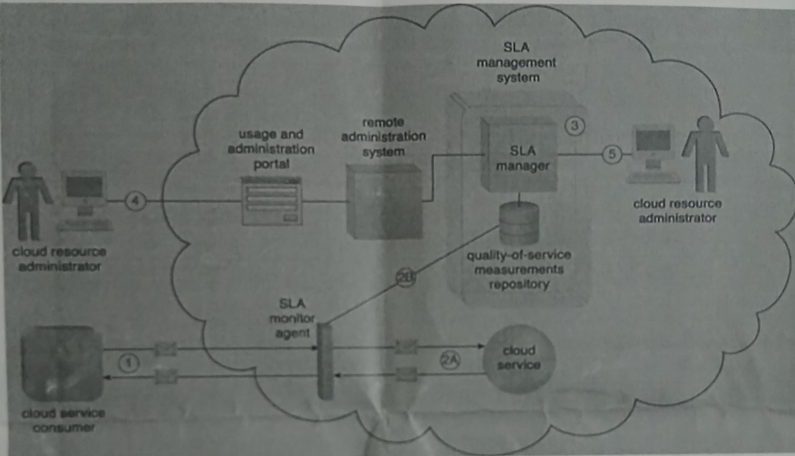

# CLOUD COMPUTING AND SERVICES

1. Define the following terms:

- i. Automatic Scaling Listener

- ii. Hypervisor

- iii. Pay Per Use Model

2. Outline FOUR characteristics of cloud computing

3. To offset the price, you pay for the cloud service, you need to realize a commensurate benefit; discuss THREE utility price models

4. Distinguish the following terminologies with relation to Cloud Computing; Multi cloud and Community Cloud

5. Discuss THREE advantages of using Private Cloud

6. Explain why many of Cloud consumers today are considering SaaS in running their business operations

7. Differentiate between the TWO types of Hypervisors

8. Differentiate between IaaS and SaaS as used in Cloud Computing

9. Discuss Multi-Cloud Cloud Service as used in Cloud Computing and give TWO reasons why an organization would consider Multi Cloud Computing environment

10. Explain TWO advantages of Virtualization in Cloud Computing

11. The figure below shows a cloud environment utilizing virtualization to provide resources to the cloud consumers. Use the case study to answer the following questions;

- i. Discuss THREE considerations that should be made to optimize the performance of the above cloud environment

- ii. Explain FOUR roles of VIM

- iii. Define the term Load Balancer and explain how such can be used in the above case

- iv. Explain THREE Security considerations that the Cloud Service Provider should consider

12. The SLA management system mechanism represents a range of commercially available cloud management products that provide features pertaining to the administration, collection, storage, reporting and runtime notification of SLA data. Use the case study below on service level management system mechanism to answer the questions that follow;

- i. State TWO main roles played by the Cloud Resource Administrator

- ii. Discuss the figure above highlighting the main technologies used and the purpose for using the following components:

      `a)` SLA Monitor Agent      `b)` SLA Management System

- iii. Discuss THREE Advanced mechanisms used on Cloud Load distribution
