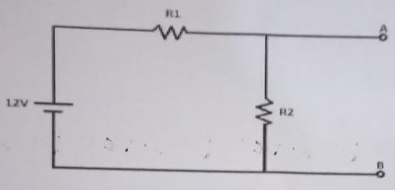
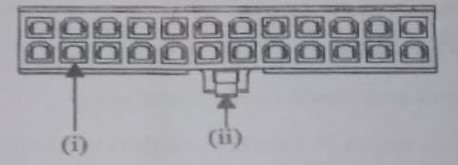

# COMPUTER SUPPORT AND MAINTENANCE

1.  Describe each of the follow types of hard disk interfaces:

         i . IDE
         ii. SATA

2.  What is the function of the following items in computer repair and maintenance:

         i. Isopropyl
         ii CMOS battery
         iii. Thermal compound

3.  Discuss two mother board form factors found in most personal computers

4.  Explain how best you would tell that the following components are faulty at start up:

         i. RAM
         ii. Hard disk drive
         iii. CMOS Battery

5.  Sarah noted that some of her documents in her computer were encrypted and she was forced to pay a certain fee through internet to decrypt her files.

        i. Identify this type of attack
        ii. Outline four possible cause for the attack identified in (i)

6.  Which procedure is recommended when cleaning inside a computer?

7.  List four advantages of Unified Extensible Firmware Interface (UEFI) over Basic Input Output System (BIOS)

8.  An employee mentions that opening a large document file is taking longer than usual. The desktop support technician suspects that there might be a fault in the hard disk. What should the technician do next?

9.  BIOS perform several critical roles in a computer. Explain two roles carried out by BIOS during booting

10. Heat sinks come in two variant types. Explain two types that could be found in computers

11. A battery of `5V` and internal resistance `1 ohm` is connected to a combination of `8 ohms` and `11 ohms` resistors connected in series with each other. Calculate the current in the circuit

12. Differentiate between a surge protector and a UPS

13. Explain the three main functions of a power supply

14. Explain any five steps a PC technician needs to take to protect themselves against electrical shock and burns.

15. Distinguish between chipset and device controller as used in computers

16. Convert each of the following storage units into their stated equivalent

        i. 12536 bits to bytes
        ii. 1048576 bytes to megabytes

17. Study the circuit diagram and answer the following question;

A voltage is applied across points `A` and `B` so that current flows from `A` to `R2` to `B`. What is the value of this voltage if the current flowing through `R2` is 4 Amperes? `R1 = 3ohms` & `R2 = 2ohms`.

18. Distinguish between parallel and pipeline processing techniques as used in computers

19. Explain two circumstances under which a computer technician would update the hardware/software inventory records.

20. Figure below shows an ATX power connector used in a motherboard. Outline the function of each of the parts labeled `(i)` and `(ii)`.

