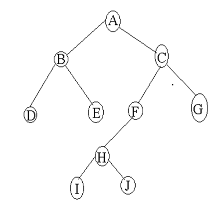

# DATA STRUCTURES AND ALGORITHMS

1.  Describe the following terms:

            (i)  Abstract Data Type
            (ii)  Data structure
            (iii) Data abstraction
            (iv)  Structured data type

2.  Using suitable examples explain the following types of trees:

            i)  Balanced binary tree
            ii)  Full binary tree
            iii)  Complete binary tree

3.  Explain why a stack is described as a LIFO structure.

4.  State an example of the ADT stack in everyday life and ADT stack applications in computer science.

5.  An array has the following elements: `{10, 7, 14, 20, 1, 5, 8}`. Starting with an empty binary search tree (BST), insert the values of the array into the binary search tree. Insert the values in the order given in the array.

6.  Use an example to declare an array to store some elements in a program

7.  Write a C/C++ program that finds the greatest integer in an array of n elements, and also outputs/displays that greatest integer.

8.  Suppose that you have a stack S and an auxiliary stack T. Show how you can do the following by using only ADT stack operations:

        i) Displaying the contents of S in reverse order    that is, displaying the top first
        ii) Count the number of items in S leaving S unchanged.

9.  Describe the following operations as used in linked lists:

            i) IsEmpty
            ii) Insert(x, i)
            iii) Delete(i)

10. Describe the two stack expressions pop() and push()

11. Using a flow chart, describe the algorithm to delete the member in position ‘I’ in a list of n elements. The algorithm should include the process of rearranging the elements so there is no gap between elements and to change the length of the list.

12. Increasing the size of a dynamically allocated array can waste storage and time. Explain.

13. Explain how a binary search algorithm works. What properties must the input have?

14. Define a linked list and examine three types of this data structure

15. Explain any two characteristics that distinguish a graph structure from a linear structure

16. Draw a simple diagram to demonstrate the graph structure

17. Describe briefly the following terms:

            i) 	Recursions algorithm
            ii)	Algorithm design
            iii) Complexity of algorithm

18. Convert the following infix expression to postfix form. Show the status of the stack after each step of the algorithm: `A/B/C-(D+E)*F`

19. Given the tree shown below, list the order of the values after traversing the nodes using the following techniques:

            i)	Breadth first
            ii)	Inorder traversal
            iii) Preorder traversal
            iv)	Postorder traversal

