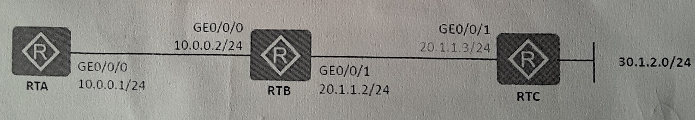

# DATA COMMUNICATION AND COMPUTER NETWORKS

1. Local Area Networks (LANS) rely on variousvaypes of transmission media to facilitate data communication. Describe three of the most common types of transmission media used in LAN environments,highlighting their characteristics

2. Router A (**RTA**) needs to forward the packets to the destination address `30.1.2.0/24`. Write the command to configure a static route for the enteprise network shown below:

3.  On VRP platform, the command lines are classified into several levels of iincreasing priority. Describe any three of these levels. For each level, include examples of use cases that demonstrate the type of commands typically found in that level.

4.  A router forwards packets based on its IP routing table.To implement routed-based packet forwarding,the router needs to obtain routes. Describe three common methods of obtaining routes.

5.  Internet Protocol version 4 (IPv4) is the underlying technology that makes it possible to connect our devices to the web. Elaborate the following:

        i. The ranges of three IPv4 and their default subnet masks
        ii. Total number of hosts in each class. Show your working

6.  OSPF sends packets to neighbors to establish and maintain adjacencies. Discuss three types of OSPF protocol packets that implement different functions in interaction between OSPF routers.

7.  You have been hired as a network administrator for a growing startup company. The company has recently expanded its office space and needs to set up a new Local Area Network to accommodate the increasing number of employees and devices.

- **i)** What is meant by the term Local Area Network?

- **ii)** Analyze two topologies that would be suitable for the LAN and, for each one, draw a labelled diagram to show its structure.

- **iii)** Discuss three hardware devices that are necessary to set up the LAN. State the functions of each device.

- **iv)** Analyze three protocols and their functions that are necessary to be configured within the local area network.

- **v)** Evaluate any three security considerations that should be considered when setting up a separate wi-fi subnet for guests

8. KANYAGIA University has hired you as a network admin to manage their network.The management has provided you with an IP address range of `10.0.0.0/24` to work with. They require multiple departments to have their own subnets for better organization and security. Using VLSM design a subnetting scheme for the company that meets the departmental requirements as shown in the table below.

| Departemnt          | Number of devices                      |
| ------------------- | -------------------------------------- |
| ICT Lab 6           | 100 desktops, 2 laptops and 2 printers |
| Exams Office        | 8 computers and 1 printer              |
| All faculty offices | 51 computers and 1 shared printer      |

- **a)** Provide the following details for each subnet:

        i. Network Address

        ii. Usable IP Range

        iii. Broadcast Address

        iv. Subnet Mask

- **b)** Describe three benefits of subnetting the above local area network.
- **c)** Explain the significance of broadcast addresses in the network.

9.  TCP/IP is a conceptual model that characterizes and standardizes the communication functions of a comuting system. Explain the funtions of each layer in the TCP/IP network achitecture model.

10. Huawei's Enterprise Network Simulation Platform (eNSP) is a powerful graphical tool used for network simulation. Imagine you are using eNSP simulator to configure and manage a simulated network environment. Write the commands required to complete the following tasks in the eNSP simulator:

        i. Check system start up configuration parameters

        ii. Configure an IP address of 10.0.0.1/24 on Router 1 interface GigabitEthernet 0/0/1

        iii. Change the user view to system view

        iv. Rename Router 1 to LAB3

        v. Save the configuration file as LAB3.cfg
