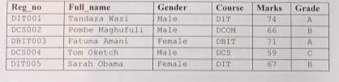
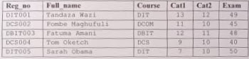

# DATABASE MANAGEMENT SYSTEM

1.  Define a database

2.  Differentiate between a database and Database management system

3.  With the use of appropriate SQL Statements, show the use of the following DDL commands as used in Oracle DBMS

         i) CREATE
         ii) ALTER
         iii) ADD
         iv) DROP

4.  A table named `Customer_records` is used to store details of students at KANYAGIA University. Use the table to answer the following questions given below;

        i) Use DDL Commands to create the Customer_records table.

        ii) Reg oo field is a Primary Key. Explain the meaning of this statement.

        iii) Using DML statements, write a query to retrieve all students with grade “B"

5.  Oracle is an Object-Relational Database Management System. Explain this statement

6.  Describe SQL and Explain any Three Languages under SQL

7.  Define table JOINS as used in DBMS

8.  Explain with appropriate examples; the following types of table joins

        i) INNER JOIN
        ii) LEFT JOIN
        iii) RIGHT JOIN

9.  Explain with examples FIVE single row functions

10. Views are useful in DBMS. Explain it and give `TWO` advantages of views in Oracle

11. Demonstrate how you create a Database using SQL Statements

12. Define functions and explain any `THREE` functions used in Oracle

13. Use the following `Pupil_results` table to answer the following questions;

i) Using single-row functions, write an SQL Query to transform pupils full names to upper cases

ii) As a database admin, you have been asked by your boss to generate a report with the following columns; `Reg_no`,`Full_name` and `Total_marks` for every student. Demonstrate how you will achieve this using SQL functions

iii) Write SQL query to compute pupils’ average scores for `Cat1`, `Cat2` and `Exam`

iv) Explain what the following SQL Query will output:
`SELECT Reg_no, LENGTH(Full_name) AS FROM pupil_results`;

14. Explain any FOUR schema objects used in Oracle

15. Explain with appropriate examples `TWO` ways of restricting table data using SQL

16. With the use of examples , explain the use of the following DCL commands in Oracle

        i)  GRANT
        ii) REVOKE

17. Explain the output of the following functions;

    i) `SELECT NVL(exam, 0) FROM student_results`

    ii) `SELECT MOD(25,7) FROM dual`

18. Differentiate between Primary Key and Foreign Key as used in DBMS

19. Explain any Two Date functions used in Oracle

20. Explain SubQuery and Elaborate its use in Oracle

21. Explain the output of the following nested function: `SELECT Full_name, ROUND(AVG (Cat1 + Cat2 + Exam) , 2) FROM student_results`

22. Using Appropriate examples, explain the use of the following in Oracle;

        i) GROUP BY
        ii) ORDER BY
        iii) DISTINCT

23. Define Data type and Explain any `THREE` data types supported by Oracle
