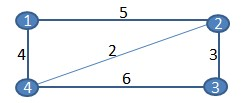
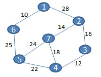

# DESIGN AND ANALYSIS OF ALGORITHMS

1. Define the term algorithm

2. Distinguish between Time complexity and Space complexity

3. The time to run an algorithm is defined by the function: $(n) = 10n^2 – 5n$. Derive the time complexity of this running time in Big-O notation

4. Distinguish among the terms: Upper bound, Lower bound and tight bound

5. Determine the minimum cost spanning tree for the weighted graph below using Prim’s algorithm:
   

6. Using the diagram in question 5, justify why Prim’s algorithm is greedy algorithm, rather than dynamic algorithm.

7. Determine the time complexity in Big-O notation for the code segment below. Explain your answer.

```c
for(int i=1; i <=10; i++){
    print("%d:",i)
}
```

8. Define a recurrence relation

9. Describe the rules of a binary search trees in respect to its nodes

10. Develop a pseudocode algorithm for inserting a new node into a BST

11. Use iteration method to find a recurrence relation and initial conditions for the series `1,5,17,53,161,485...` . Show all your working

12. Given the array below, construct the corresponding max binary heap

    | 40  | 12  | 64  | 10  | 37  | 90  | 50  | 97  |
    | --- | --- | --- | --- | --- | --- | --- | --- |

13. You are given function $f(n)$ that represents time taken to process input of size $n$. Another function $C*g(n)$ describes a function $g(n)$ multiplied by a constant $C$ and represents the upper bound, average bound and lower bound of $f(n)$.

    Using suitable mathematical expressions describe the relationship between $f(n)$ and each asymptotic notation $O(g(n)),$ $\Omega(g(n))$ and $\Theta(g(n))$

14. Explain TWO differences between the binary heap and the binary search tree

15. Given $f(n)=100n +10n^2$, determine its time complexity in Big-O notation

16. Describe one function other than $O(g(n))$ (upper bound for function $f(n)$) given in question 15 above

17. Explain why you consider the time complexity for binary search of a sorted array to be Big-O(log n)

18. Differentiate between greedy algorithm and dynamic algorithm

19. Given the weighted graph below, derive the minimum cost spanning tree. The costs are indicated at the edges.
    

20. Write a pseudocode algorithm for searching a value in a sorted array using the binary search method.
