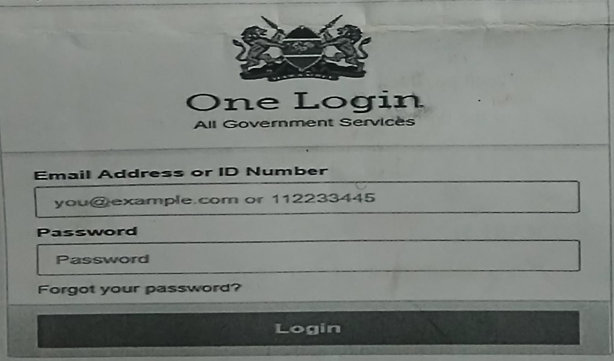
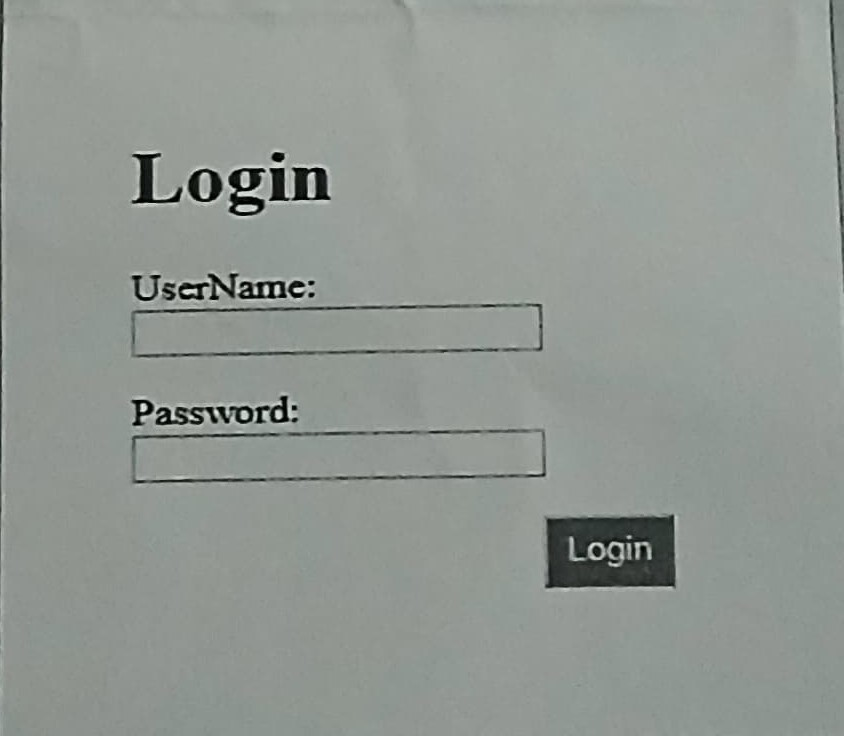

# INTERNET PROGRAMMING 2

1.  Several Web components work together to run a web page. Outline THREE of these web components.

2.  Implementing a Python interface for database access using Tkinter is crucial for managing data in a desktop application. Discuss TWO advantages and TWO challenges of using Tkinter for database interactions in a Python-based server application.

3.  Write a PHP code that will capture the user input as per the form below, process and grant or deny access to services.
    

4.  Give THREE reasons as why you would choose to use server-side processing over client- side processing for your ICT based projects.

5.  You are developing a real-time chat application that relies on constant communication between clients and a central server.

        i. Explain FOUR key considerations and challenges in implementing a robust client-server communication protocol.

            ii. Describe how the HTTP protocol fit into this scenario.

6.  Which PHP functions are used to achieve the following with MySQL database server on the local machine? Use example to show how each is implemented

    i. Connect to the server with username `root` and password `zu_pw0l`
    ii. Select a database called `zu_db002` to be used for queries
    iii. Execute a query select all rows and columns from the table `zu_users`

7.  Using a well labelled diagram of web communication architecture to answer the following questions:

    i. Describe webserver-client communication

    ii. Distingush between the HTTP Request and Response

8.  Using Examples, explain what you understand by the following in relation to web applications;

    i. Content management systems(CMS)

    ii. Framework

9.  You are required to write codes to validate the form before submission to the server for processing. Write source codes to validate the form fields as follows:

    i. Validate the password field to ensure it is at least 8 characters long

    ii. Validate the email address provided and print the error message "`Email is required`” when email has not been provided

    iii. Check the validity of the domains name provided in the email and display the error message “`Please enter a valid email address`” for an invalid domain name

10. Suppose that there is a new document type that needs to be displayed on the client's computer and that you need to introduce a new MIME type for this document type. Let us use Microsoft Excel charts as an example, write down explaining all the options to be considered on how this could be achieved.

11. Web applications are built in standards-based technologies such as PHP and other modern web technologies. Web applications can run on pretty much any platform with a modern web standards compliant web browser. All above is what has made web applications popular

    i. State and explain any three good reasons for companies to build web applications.

    ii. Explain web application development process, which provides a good outline for a web applicaion lifecycle process

12. As a PHP programmer, develop a form that sends your registration number and phone number to a PHP file called `contact.php`. In this PHP file, capture and display the phone number received from the form.

13. Use a PHP script to demonstrate an Array that stores THREE flavors of LINUX namely `Redhat, Suse & Kali`. The flavors should be received from the user interactively.

14. Cookies in websites are used to identify users. Write a PHP script that creates a cookie called `myUser` with the value `Server Side`. The cookie should expire in 20 days.

15. Zetech University intends to sensitize its website users (Student and Staff portals) on possible security attacks. Describe three such attacks and ways of dealing with the attacks.

16. Write PHP source codes for two files named `connection.php` and `authentication.php` that will allow the user to log in as per the form given below:
    
