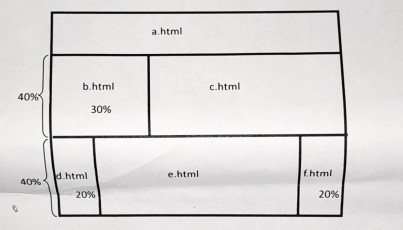

1.  Distinguish between the following as used in internet programming

    i) HTML element and Attributes
    ii)Server-side scripting and client-side scripting
    iii) Static and dynamic web pages

2.  Explain the use of the following tags in HTML;

    i) ``
    ii) `<abbr>`
    ii) `&nbsp`
    iv) `
`

3.  Write a HTML code that creates a scrolling list to show four items from the following list of personal computer processor types: Motorola 68000, Intel 8088, Intel Pentium MMX,
    Intel Pentium II, Intel Pentium III, Intel Celeron, PowerPC G3,PowerPC G4, AMD Athlon.

4.  An IT firm based in Kisumu is prone to external website attacks. Explain `four` ways in which the firm can protect itself against these attacks.

5.  Using syntax in each case, explain any Three types of Frames in HTML.

6.  Explain `two` challenges a web design project team is likely to encounter and how each challenge can be resolved

7.  A form statement is found to have the following content. Explain the elements of the following statement:
    `<FORM METHOD=POST ACTION = "https://192.168.13.101/cg-in/demonapp.pl">`

8.  Outline the HTML / CSS elements necessary to achieve the following tasks:

        i. Merge three data cells that are within the same column
        ii. Give the row in a table the same back ground color
        iii. Fix the width of a column in a table to 300 pixels
        iv. Make the table fill the entire display of the computer window.

9.  As a web designer describe `four` design issues you would consider for a web site other than aesthetic and usability ones

10. Explain `four` qualities of a good web designer.

11. Create a HTML document that displays an alert dialogue box with the message;
    `"Welcome to my page"`, immediately the page loads.

12. Write HTML code that generates the following table used at Zetech to enter CAT marks for students;

    | REG_NO      | STUDENT NAME | CAT1 | CAT2 | CAT3 | TOTAL |
    | ----------- | ------------ | ---- | ---- | ---- | ----- |
    | BIT-001-024 | Tim          | 7    | 7    | 5    | 19    |
    | BIT-933-023 | Sharon       | 8    | 5    | 6    | 19    |
    | BIT-113-023 | Joseph       | 6    | 5    | 9    | 20    |
    | BIT-242-023 | John         | 10   | 4    | 8    | 22    |
    |             |              |      |      |      |       |

13. Write a JavaScript code embedded on an HTMLpage to outputthe statement `"Sorry the page is under construction"` when a user clicks on a button named "Latest
    updates"

14. Generate a HTML code that will render the page layout below by using frames. The names of the documents to be loaded on each frame and the relative frame sizes are provided where necessary.

    

15. After a web programmer has developed and tested his or her web application locally, i.e. on his/her machine, he/she needs to publish the website for public viewing. Explain `FOUR` activities which he/she may be required to perform during web publication.
