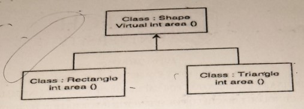

1.  Differentiate between the following terms:

        i. Identifier and Variable
        ii. Return and Break Statement

2.  What is the main significanceof VisualStudio.NET with respect to having an Integrated Development Environment?

3.  Write a program in C# Sharp to create a function for the sum of two numbers.

4.  GUI is said to be a common feature in modern systems. Explain how C# can be used to create a GUI.

5.  Draw the UML diagram of a class named "Student" with a single attribute "name" of type string, and two methods; Set Name and Get Name.

6.  Program flow charts and pseudocode are tools used for program design.Draw a flow chart
    to solve the general quadratic equation:
    `X² + bx + c=0`

7.  Write a C# program that uses necessary data members to compute area of each shape while implementing inheritance shown below:
    

8.  Define the following terms:

        i. Exception handling
        ii. Generic Types

9.  C# relies heavily on classes, using UML,explain the components of a class.

10. Discuss the following terms in Microsoft Intermediate Language (MSIL)and just-in
    time (JIT) Compilation as used in .NET Technologies.

11. Write a C# program that reads a user's age and then displays the following information according to the age of the user;

        If age is below 18 – You are a child
        If age is between 18 and 65 – You are an adult
        If age is above 65 - You are a senior citizen

12. Write an if-else statement that assigns `0.1` to z if y is greater or equal than `0`,and
    assigns ` -0.1` to z otherwise.

13. Differentiate between the following types of polymorphism;

        i. Compile Time Polymorphism
        ii. Run Time Polymorphism

14. C# provides for automatic "boxing and unboxing" of primitive value types. Why is
    this potentially more efficient than simply eliminating primitive types and making
    everything an object?

15. List and explain any `Four` features of an OOP language.

16. What will be the output of the code below?

```
Class test
{
    String str1 = "Hello"
    Public static void Main()
    {
        str1 += " World";
        Console.WriteLine(str1);
    }
}
```

17. List `3` regular programming tasks carried out in VisualStudio. NET.

18. Write a C# program to compute examination grade based on the percentage marks of three subjects i.e. `ICT,BCOM,ECON`. Read the marks of the subjects and compute the grade using the select case statement based on the grading criteria below:

    | Marks | Grade        |
    | ----- | ------------ |
    | >=75  | Distinction  |
    | >=60  | First Class  |
    | >=50  | Second Class |
    | >=40  | Pass class   |
    | <40   | Fail         |

19. Write a program in C# to display a pattern like a right angle triangle using for loop. The pattern should look like this:

        *
        **
        ***
        ****
